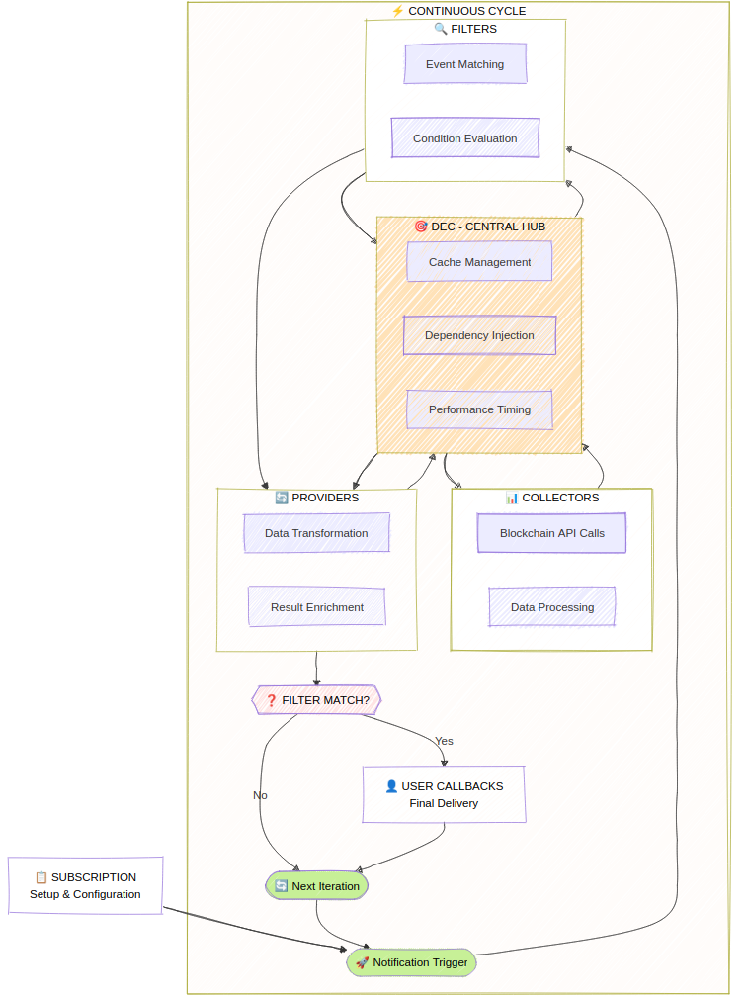

# Core Architecture

WorkerBee is built on a sophisticated multi-layered architecture that ensures high performance, reliability, and ease of use. Understanding this architecture helps you leverage WorkerBee's full potential.

## :mag: Architectural Overview

{.rounded-lg}

## :robot_face: Data Evaluation Context (DEC)

The **Data Evaluation Context** is WorkerBee's central nervous system. It orchestrates all data flow and provides:

### Dependency Injection

The DEC automatically resolves dependencies between collectors, ensuring the right data sources are available when needed:

```typescript
// When you use both post and account filters
workerbee.observe
  .onPosts("alice")
  .onAccountsBalanceChange(false, "alice")
  .subscribe(/* ... */);

// DEC automatically injects:
// - OperationCollector (for posts)
// - AccountCollector (for balance changes)
// - BlockCollector (dependency of both)
// - DynamicGlobalPropertiesCollector (dependency of BlockCollector)
```

### Smart Caching System

Within each evaluation cycle, the DEC maintains a shared cache that dramatically reduces API calls:

```typescript
// These operations share cached blockchain data
workerbee.observe
  .onPosts("alice")      // Needs operation data
  .onComments("alice")   // Also needs operation data (shared cache!)
  .onVotes("alice")      // Also needs operation data (shared cache!)
  .subscribe(/* ... */);

// Result: 1 API call instead of 3! 🚀
```

### Cycle Management

The DEC manages evaluation cycles intelligently:

- **Historical Mode**: Fast processing of past blocks
- **Live Mode**: Time-based cycles (default: 2 seconds)

## :mag_right: Filters Layer

Filters evaluate blockchain conditions and determine when your observers should be triggered.

### Parallel Execution

All filters run concurrently for maximum performance:

```typescript
workerbee.observe
  .onPosts("alice")           // Filter 1 (parallel)
  .onComments("bob")          // Filter 2 (parallel)
  .onAccountsBalanceChange(false, "charlie") // Filter 3 (parallel)
  .subscribe(/* ... */);
```

### Short Circuit Evaluation

When any filter matches, WorkerBee uses short-circuit evaluation to stop unnecessary processing:

```typescript
workerbee.observe
  .onPosts("alice")     // ✅ Matches first
  .onComments("bob")    // ❌ Cancelled (short circuit)
  .onVotes("charlie")   // ❌ Cancelled (short circuit)
  .subscribe(/* ... */);
```

{.rounded-lg}

## :truck: Providers Layer

Providers gather and transform data for your observers, running only when filters pass.

### Data Transformation

Providers normalize raw blockchain data into WorkerBee's clean API:

```typescript
// Raw blockchain operation data → Clean post objects
{
  "op": ["comment", {
    "parent_author": "",
    "parent_permlink": "hive",
    "author": "alice",
    "permlink": "my-post",
    "title": "Hello World",
    "body": "This is my post content...",
    "json_metadata": "{\"tags\":[\"hive\"]}"
  }]
}

// ↓ Becomes ↓

{
  posts: {
    alice: [{
      author: "alice",
      permlink: "my-post",
      title: "Hello World",
      body: "This is my post content...",
      tags: ["hive"],
      created: "2024-01-01T12:00:00.000Z"
    }]
  }
}
```

### Concurrent Processing

Like filters, providers run in parallel:

```typescript
workerbee.observe
  .onPosts("alice")
  .provideAccounts("alice", "bob")    // Provider 1 (parallel)
  .provideFollowCounts("alice")       // Provider 2 (parallel)
  .provideVotingPower("alice")        // Provider 3 (parallel)
  .subscribe(/* ... */);
```

## :shopping_trolley: Collectors Layer

Collectors are the data acquisition layer, responsible for fetching information from various sources.

### Dependency Resolution

Collectors can depend on each other, and the DEC resolves these dependencies automatically:

```typescript
// BlockHeaderCollector depends on DgpoCollector
workerbee.observe
  .onBlock()
  .subscribe(/* ... */);
// DEC injects BlockCollector automatically
```

### Overriding Collectors

One of WorkerBee's powerful features is the ability to override multiple collectors using only one collector when it can retrieve all necessary data e.g. from a single API call. This happens automatically via the DEC.

The best example is the `HistoryDataFactory`, which uses only one API call to fetch all required data for historical analysis of block headers, block content and dynamic global properties state.

## :arrows_clockwise: Data Flow Example

Let's trace a complete data flow for this observer:

```typescript
workerbee.observe
  .onPosts("alice")
  .provideAccounts("alice")
  .subscribe({
    next: ({ posts, accounts }) => {
      console.log('New post:', posts.alice[0].title);
      console.log('Alice balance:', accounts.alice.balance);
    }
  });
```

### Step-by-Step Flow

1. **DEC Initialization** 🧠
   - Analyzes required filters: `PostFilter`
   - Analyzes required providers: `AccountProvider`
   - Injects collectors: `OperationCollector`, `AccountCollector`, `BlockCollector`

2. **Data Collection** 🛒

   ```text
   BlockCollector → Fetches latest block data
   OperationCollector → Extracts operations from blocks
   AccountCollector → Fetches Alice's account data
   ```

3. **Filter Evaluation** 🔎

   ```text
   PostFilter → Checks operations for Alice's posts
   ✅ Found new post → Trigger providers
   ```

4. **Provider Execution** 🚚

   ```text
   PostProvider → Transforms post operations to clean objects
   AccountProvider → Transforms account data to clean objects
   ```

5. **Observer Callback** 🤳

   ```text
   Your code receives: { posts: {...}, accounts: {...} }
   ```

## 🛠️ Custom Filters & Providers Architecture

WorkerBee supports custom filters and providers for extending functionality beyond built-in capabilities.

### Custom Filter Architecture

[`Custom filters`](./api-reference#filter) integrate seamlessly with the DEC system:

```typescript
// Custom filter has full access to cached data
bot.observe.filter({
  async match(data: DataEvaluationContext) {
    // Access cached blockchain data
    const { currentWitness } = await data.get(DynamicGlobalPropertiesClassifier);

    // Implement custom logic
    const externalData = await fetch(`/api/witness/${currentWitness}`);
    const { isReliable } = await externalData.json();

    return isReliable && currentWitness === "my-witness";
  }
});
```

**Architecture Benefits:**

- **DEC Integration**: Full access to cached collectors
- **Performance**: Reuses existing data rather than re-fetching
- **Flexibility**: Implement any custom logic
- **Type Safety**: TypeScript support throughout

### Custom Provider Architecture

[`Custom providers`](./api-reference#provide) follow the same pattern as built-in providers:

```typescript
bot.observe.provide({
  async provide(data: DataEvaluationContext) {
    // Access blockchain data
    const { currentWitness } = await data.get(DynamicGlobalPropertiesClassifier);

    // Enrich with external data
    const stats = await this.fetchWitnessStats(currentWitness);

    return {
      witnessInfo: {
        name: currentWitness,
        ...stats
      }
    };
  }
});
```

### Store-Based Data Sharing

Use the DEC store to share data between custom components:

```typescript
import { CollectorClassifierBase } from '@hiveio/workerbee';

// Create custom classifier for shared state
class MySharedData extends CollectorClassifierBase<{ cache: any }> {}

// Filter stores data
bot.observe.filter({
  async match(data: DataEvaluationContext) {
    const store = data.accessStore(MySharedData);
    store.cache = { timestamp: Date.now(), computed: true };
    return true;
  }
})
// Provider accesses stored data
.provide({
  async provide(data: DataEvaluationContext) {
    const store = data.accessStore(MySharedData);
    return { fromFilter: store.cache };
  }
});
```

### Filter Piped Architecture

If you want to simultaneously use filters and providers accessing the same data via DEC store, it is easier to use filters with piped provider data system.

The [`filterPiped`](./api-reference#filterpiped) method creates a provider-filter chain where the provider runs first:

```typescript
bot.observe.filterPiped(
  // Provider function - runs first
  async (data: DataEvaluationContext) => {
    const externalData = await fetch('/api/status');
    return { apiStatus: await externalData.json() };
  },
  // Filter function - uses provider data
  ({ apiStatus }, data: DataEvaluationContext) => {
    return apiStatus.healthy && apiStatus.load < 0.8;
  }
);
```

**Execution Flow:**

1. **Provider Phase**: Fetches external data
2. **Filter Phase**: Evaluates condition using provider data
3. **Data Assembly**: Provider data becomes part of notification
4. **Notification**: Both blockchain and external data available

## :chart_with_upwards_trend: Performance Optimizations

### Caching Strategy

- **Per-Cycle Caching**: Data is cached only within each evaluation cycle
- **Atomic Snapshots**: All components see consistent blockchain state
- **Memory Efficient**: Cache is cleared between cycles

### Concurrency Benefits

- **Filter Parallelism**: All conditions evaluated simultaneously
- **Provider Parallelism**: Data transformation happens concurrently
- **Short-Circuit Logic**: Unnecessary work is cancelled early

### Smart Resource Management

- **On-Demand Collection**: Data is only fetched when actually needed
- **Dependency Optimization**: Shared dependencies are resolved once
- **API Call Reduction**: Up to 50% fewer API calls in complex scenarios:

| &nbsp; | WorkerBee without DEC Cache | WorkerBee with DEC Cache | Naive implementation |
|:------------------ |:------------:|:-------------------:|:---:|
| API Calls per cycle **\***  |      6       |         **3**     | 10        |
| Network Latency             |    500ms     |       **250ms**   | 830ms     |
| Throughput                  |      –       |       **+2×**     | -0.7x     |
| Node Load                   |     High     |       **Low**     | Very High |

**\*** - A Number of calls calculated based on the scenario of operation filter, 3 accounts filter and operation & account provider

## :bulb: Architecture Benefits

### Separation of Concerns

Each layer has a single responsibility, making the system maintainable and testable.

### Loose Coupling

Components communicate through well-defined interfaces, allowing easy substitution.

### High Performance

Concurrent execution and intelligent caching provide optimal performance.

### Flexibility

The layered architecture supports multiple data sources and custom extensions.

### Testability

Each component can be tested in isolation with dependency injection.

This architecture ensures that WorkerBee can scale from simple use cases to complex enterprise applications while maintaining excellent performance and developer experience.

## :factory: Collector Factories

WorkerBee uses different factory patterns for live and past data. The mediator automatically switches between these factories without user interaction, preserving the internal application state. This seamless transition is possible thanks to the factories' extend functionality - each factory can extend itself with state from other factories.

### JsonRpcFactory (Live Data)

The `JsonRpcFactory` provides a comprehensive set of collectors for real-time data:

- **AccountCollector**: Real-time account information
- **FeedPriceCollector**: Current feed price data
- **WitnessCollector**: Witness information and schedules
- **RcAccountCollector**: Resource Credit account data
- **ManabarCollector**: Live manabar calculations

### HistoryDataFactory (Past Data)

The `HistoryDataFactory` uses a more limited set optimized for historical analysis:

- **BlockCollector**: Historical block data via `get_block_range`
- **DynamicGlobalPropertiesCollector**: Chain state at specific points
- **ImpactedAccountCollector**: Accounts affected by operations
- **OperationCollector**: Historical operations from blocks

### Factory Switching

The automatic factory switching allows you to seamlessly transition from historical analysis to live monitoring:

```typescript
// First, analyze historical data
bot.providePastOperations(startBlock, endBlock)
  .onPosts("alice")
  .subscribe({
    next(data) {
      // Process historical data using HistoryDataFactory
    },
    complete() {
      // Historical analysis complete, now switch to live mode
      bot.observe
        .onPosts("alice")
        .subscribe({
          next(data) {
            // Process live data using JsonRpcFactory
            // Historical context is preserved!
          }
        });
    }
  });
```
