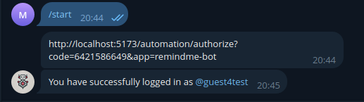
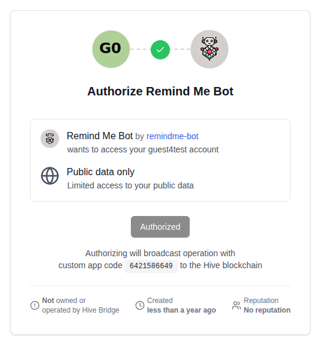
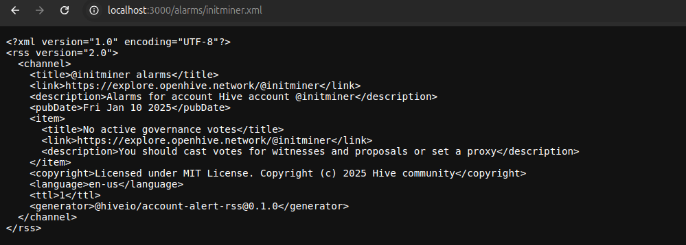
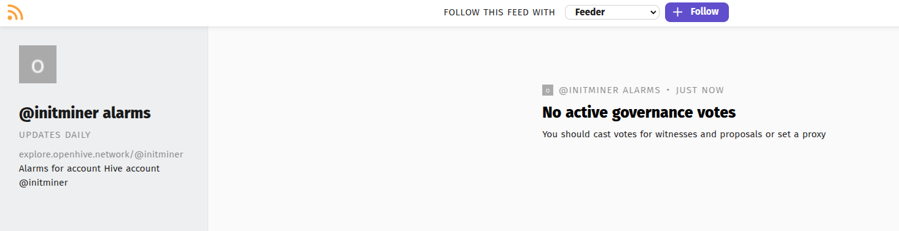
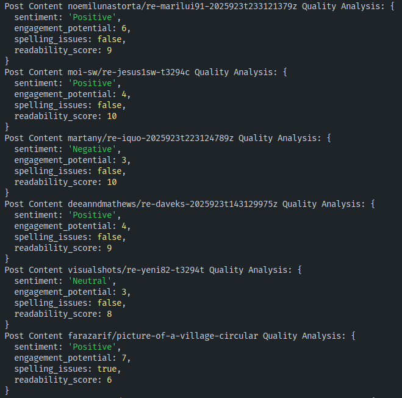

# Advanced Examples

Explore sophisticated use cases and patterns with WorkerBee. These examples demonstrate real-world applications and advanced techniques.

!!!warning Dependencies & Environment Variables
Some examples use the [dotenv](https://npmjs.com/package/dotenv) package to read from a [.env](https://www.dotenv.org/docs/security/env#example) file.

Create a `.env` file in your project root with the specified by each example environment variables.

!!!

!!! TypeScript Support
If you are working with TypeScript, ensure you have the necessary type definitions installed:

```bash
pnpm add -D @types/node
```

!!!

## :robot_face: Node.js Intelligent Voting Bot

A smart voting bot that considers multiple factors before casting votes.

!!!secondary Environment Variables

- `POSTING_WIF_KEY` - Posting private key for your Hive account.
- `HIVE_ACCOUNT` - Your Hive account name used for voting.

!!!

```typescript
// Prepare imports
import createBeekeeper from '@hiveio/beekeeper';
import BeekeeperProvider from '@hiveio/wax-signers-beekeeper';
import { createHiveChain, EManabarType } from '@hiveio/wax';
import WorkerBee from '@hiveio/workerbee';
import dotenv from 'dotenv';

// Load .env variables
dotenv.config();

const temporaryWalletName = "w0";
const privateKey = process.env.POSTING_WIF_KEY as string;
const accountName = process.env.HIVE_ACCOUNT as string;

// Initialize @hiveio packages
const wax = await createHiveChain();

// Create temporary in-memory Beekeeper instance for more convenient key management
const beekeeper = await createBeekeeper({ inMemory: true });
const session = beekeeper.createSession("salt" + Math.random());

// As we are using in-memory beekeeper, we need to create and import keys on each run
const { wallet } = await session.createWallet(temporaryWalletName, Math.random().toString(), true);
const publicKey = await wallet.importKey(privateKey);

const beekeeperProvider = BeekeeperProvider.for(wax, wallet, publicKey);

// Initialize WorkerBee with explicit Hive chain to prevent unnecessary reinitialization
// This is highly recommended, but not breaking nor strictly required for the app to work
const wb = new WorkerBee({
  explicitChain: wax
});
await wb.start();

// Define function for upvoting posts
const upvote = async (author: string, permlink: string) => {
  // Catch errors here so they can be logged but won't discard the whole voting stream
  try {
    const tx = await wax.createTransaction();
    tx.pushOperation({
      vote_operation: {
        author,
        permlink,
        voter: accountName,
        weight: 10000 // 100% upvote
      }
    });

    // Sign the transaction with Beekeeper
    await beekeeperProvider.signTransaction(tx);

    // Broadcast the transaction to the Hive network
    await wax.broadcast(tx);

    console.log(`Upvoted @${author}/${permlink} with 100% weight @ tx #${tx.id}`);
  } catch (error) {
    console.error("Upvote error:", error);
  }
};

// Actual bot code
wb.observe
  // Listen to new posts by specified accounts
  .onPosts("gtg", "blocktrades", "thebeedevs")
  // Provide upvote manabar data for me to check if I can upvote
  .provideManabarData(EManabarType.UPVOTE, accountName)
  .subscribe({
    // Error handling callback:
    error: console.error,
    // This function can be async too with no error handling on my side as it will be automatically forwarded to error callback
    next: async ({ manabarData, posts }) => {
      const manabarLoad = manabarData.gtg?.[EManabarType.UPVOTE]?.percent;

      // No manabar data available, skip
      // This can happen if the account does not exist
      if (manabarLoad === undefined) return;
      console.log(`New posts detected. @${accountName} upvote manabar load: ${manabarLoad}%`);

      if (manabarLoad >= 98) {
        for(const author in posts) {
          for(const post of posts[author]) {
            console.log(`Upvoting @${post.author}/${post.permlink}...`);

            // Note: This function is async, but we don't await it here to avoid blocking the stream
            upvote(post.author, post.permlink);
          }
        }
      }
    }
  });
```

## :closed_lock_with_key: Telegram Authorization Bot

A bot that proofs user Hive account ownership via Telegram. **No more guessing usernames!**

!!!secondary Environment Variables

- `BOT_TOKEN` - Telegram bot token from [BotFather](https://core.telegram.org/bots/features#creating-a-new-bot)
- `BRIDGE_URL` - URL of your Hive dAppAuth bridge instance. This would be usually [https://auth.openhive.network](https://auth.openhive.network) or similar.
- `HIVE_ACCOUNT` - Your Hive account name used as a dApp identifier in the dAppAuth operations. This wil be displayed to users when they authorize.

!!!

```typescript
// Prepare imports
import { Telegraf } from 'telegraf';
import WorkerBee from '@hiveio/workerbee';
import dotenv from 'dotenv';

// Load .env variables
dotenv.config();

// Initialize WorkerBee and Telegram bot
const wb = new WorkerBee();
await wb.start();

const tg = new Telegraf(process.env.BOT_TOKEN as string);

// Handle /start command
tg.start(ctx => {
  ctx.reply(`${process.env.BRIDGE_URL}/automation/authorize?code=${ctx.message.from.id}&app=${process.env.HIVE_ACCOUNT}`)
});
tg.launch();

// Track already authorized users to avoid spamming
const alreadyAuthorized = new Set<string>();

// Listen for dappauth operations
wb.observe
  .onCustomOperation("dappauth") // This custom operation is used by dAppAuth
  .subscribe({
    // Log all errors:
    error: console.error,
    // Process new operations:
    next: async ({ customOperations }) => {
      for(const { operation } of (customOperations.dappauth || [])) {
        if ("json" in operation) {
          try {
            // Parse JSON data
            const { dapp, code } = JSON.parse(operation.json);

            // Only process operations for our dapp
            if (dapp !== process.env.HIVE_ACCOUNT) continue;

            // Skip if already authorized
            if (alreadyAuthorized.has(code)) continue;

            // Send confirmation message to user
            await tg.telegram.sendMessage(code, `You have successfully logged in as @${operation.required_posting_auths.join(', @')}`);

            // Mark this code as authorized
            alreadyAuthorized.add(code);
          } catch (e) {
            console.error("Invalid JSON in dappauth operation:", operation.json);
          }
        }
      }
    }
  });

// Enable graceful stop
process.once('SIGINT', () => { wb.stop(); tg.stop('SIGINT') })
process.once('SIGTERM', () => { wb.stop(); tg.stop('SIGTERM') })
```

### Authorization flow





## :bell: RSS Advanced Notification System

A comprehensive notification system for RSS feeds regarding critical account updates.

!!!secondary RSS clients

For testing, you can use any RSS reader app or website. Some popular options include:

- [Feedly](https://feedly.com/news-reader#:~:text=RSS)
- [Inoreader](https://www.inoreader.com/blog/2024/01/stay-in-the-know-with-monitoring-feeds.html)
- [RSS Feed Reader Chrome Extension](https://chromewebstore.google.com/detail/rss-feed-reader/pnjaodmkngahhkoihejjehlcdlnohgmp)
!!!

!!! Dependencies

- `express` - Web server to serve the RSS feed.
- `cors` - Middleware to enable [CORS](https://developer.mozilla.org/en-US/docs/Web/HTTP/CORS) for the RSS feed - may be required by some clients.
- `@types/express`, `@types/cors` - TypeScript-only types for the above packages.
!!!

```typescript
// Prepare imports
import WorkerBee, { EAlarmType } from "@hiveio/workerbee";
import express from 'express';
import cors from 'cors';

// Create express server with CORS enabled
const app = express();
app.use(cors());

// Listen on port 3000
const server = app.listen(3000);

const wb = new WorkerBee();
await wb.start();

// Utility functions to stringify and describe alarm codes
export const stringifyAlarmCode = (alarmCode: EAlarmType): string => {
  switch (alarmCode) {
    case EAlarmType.DECLINING_VOTING_RIGHTS:
      return 'Declining voting rights is underway for the account';
    case EAlarmType.GOVERNANCE_VOTE_EXPIRATION_SOON:
      return 'Governance votes will expire soon';
    case EAlarmType.GOVERNANCE_VOTE_EXPIRED:
      return 'No active governance votes';
    case EAlarmType.LEGACY_RECOVERY_ACCOUNT_SET:
      return 'Your recovery account is listed as a warning account';
    case EAlarmType.RECOVERY_ACCOUNT_IS_CHANGING:
      return 'Setting the recovery account to is in progress';
  }
};
export const describeAlarmCode = (alarmCode: EAlarmType): string => {
  switch (alarmCode) {
    case EAlarmType.DECLINING_VOTING_RIGHTS:
      return 'You can cancel it by creating a decline operation with the `decline` value set to false before effective date';
    case EAlarmType.GOVERNANCE_VOTE_EXPIRATION_SOON:
    case EAlarmType.GOVERNANCE_VOTE_EXPIRED:
      return 'You should cast votes for witnesses and proposals or set a proxy';
    case EAlarmType.LEGACY_RECOVERY_ACCOUNT_SET:
      return 'You should change it to account other than the warning account';
    case EAlarmType.RECOVERY_ACCOUNT_IS_CHANGING:
      return 'You can cancel it by setting a recovery account to the previous one';
  }
};

const accountAlarms = new Map<string, EAlarmType[]>();

let previousUnsubscribe = () => {};

// This function is called to reinitialize the alarm listener whenever a new account is added
// This is necessary because WorkerBee's onAlarm method requires the full list of accounts to observe
const reinitializeAlarmListener = () => {
  const observer = wb.observe.onAlarm(...accountAlarms.keys());

  // Unsubscribe from previous subscription if exists and subscribe to a new one
  previousUnsubscribe();

  ({ unsubscribe: previousUnsubscribe } = observer.subscribe({
    error: console.error,
    next({ alarmsPerAccount }) {
      // Clear the existing map before updating
      accountAlarms.clear();

      // Update the map with the new alarms for each account
      for(const account in alarmsPerAccount)
        accountAlarms.set(account, [...alarmsPerAccount[account]!]);
    }
  }));
};

app.get('/alarms/:account', (req, res, next) => {
  if (!req.params.account) {
    res.status(400).send('Account is required');
    return;
  }
  if (!req.params.account.endsWith('.xml'))
    return next();

  const account = req.params.account.slice(0, -4);

  let currentAccountAlarms = accountAlarms.get(account);
  const isAlreadyObservingAccount = currentAccountAlarms !== undefined;

  if (!isAlreadyObservingAccount) {
    console.log(`🤖 📡 New account for alarms: ${account}`);
    currentAccountAlarms = [];
    accountAlarms.set(account, currentAccountAlarms);

    reinitializeAlarmListener();
  }

  res.status(200).contentType('application/rss+xml').send(`<?xml version="1.0" encoding="UTF-8"?>
<rss version="2.0">
  <channel>
    <title>@${account} alarms</title>
    <link>https://hive.blog/@${account}</link>
    <description>Alarms for account Hive account @${account}</description>${
      currentAccountAlarms!.map(alarmCode => `
    <item>
      <title>${stringifyAlarmCode(alarmCode)}</title>
      <link>https://hive.blog/@${account}</link>
      <description>${describeAlarmCode(alarmCode)}</description>
    </item>`).join('')}
    <language>en-us</language>
    <ttl>1</ttl>
  </channel>
</rss>`);
    });

console.log(`🐝 Observing for new accounts on RSS 🐝`);

const stopFn = () => {
  wb.stop();
  wb.delete();
  server.close(console.error);
};
process.once('SIGINT', stopFn.bind('SIGINT'));
process.once('SIGTERM', stopFn.bind('SIGTERM'));
```

### RSS Feed Example





## :mag_right: AI-powered Content Quality Analyzer

Analyze and score content quality using various metrics.

!!!secondary Environment Variables

- `OPENAI_API_KEY` - Your OpenAI API key from [OpenAI](https://platform.openai.com/account/api-keys)
!!!

!!! Dependencies

- `openai` - Official OpenAI SDK for API access.
!!!

```typescript
// Prepare imports
import OpenAI from "openai";
import dotenv from "dotenv";
import WorkerBee from '@hiveio/workerbee';

dotenv.config();

const openai = new OpenAI({
  apiKey: process.env.OPENAI_API_KEY,
});

// Utility function wrapping the request creation
const createRequest = (userContent: string) => openai.responses.create({
  model: "gpt-4.1-mini",
  input: [
    {
      "role": "system",
      "content": [
        {
          "type": "input_text",
          "text": "Calculate provided user post content quality regarding sentiment, engagement potential, spelling issues and overall readability score. Text can be provided in markdown or HTML syntax. Ignore syntax issue and focus only on the readable content"
        }
      ]
    },
    {
      "role": "user",
      "content": [
        {
          "type": "input_text",
          "text": userContent
        }
      ]
    },
  ],
  text: {
    // Define the structure of the response using JSON Schema standard
    "format": {
      "type": "json_schema",
      "name": "post_content_quality",
      "strict": true,
      "schema": {
        "type": "object",
        "properties": {
          "sentiment": {
            "type": "string",
            "description": "Overall sentiment of the post",
            "enum": [
              "Positive",
              "Neutral",
              "Negative",
              "Mixed"
            ]
          },
          "engagement_potential": {
            "type": "number",
            "minimum": 0,
            "maximum": 10,
            "description": "Likelihood this content will prompt user interaction (0-10, higher is more engaging)"
          },
          "spelling_issues": {
            "type": "boolean",
            "description": "Whether there are spelling mistakes present in the post"
          },
          "readability_score": {
            "type": "number",
            "minimum": 0,
            "maximum": 10,
            "description": "Flesch reading ease score (0-10, higher is easier)"
          }
        },
        "required": [
          "sentiment",
          "engagement_potential",
          "spelling_issues",
          "readability_score"
        ],
        "additionalProperties": false
      }
    }
  },
  temperature: 1,
  max_output_tokens: 1000,
  top_p: 1
});

const wb = new WorkerBee();
await wb.start();

wb.observe
  .onBlock()
  .provideBlockData()
  .subscribe({
    error: console.error,
    next: async ({ block }) => {
      for (const { transaction } of block.transactions) {
        for (const op of transaction.operations) {
          if (op.comment_operation) {
            const permlink = `@${op.comment_operation.author}/${op.comment_operation.permlink}`;
            try {
              const response = await createRequest(op.comment_operation.body);
              const result = JSON.parse(response.output_text);

              console.log(`Post Content ${permlink} Quality Analysis:`, result);
            } catch (error) {
              console.error(`Error processing post ${permlink}:`, error);
            }
          }
        }
      }
    }
  });
```

### Example Output



## :trophy: REST API Achievement System

Gamify user engagement with an achievement system.

This example also leverages the power of WorkerBee to analyze past operations and maintain a local state.

!!! Dependencies

- `express` - Web server to serve the REST API.
- `cors` - Middleware to enable [CORS](https://developer.mozilla.org/en-US/docs/Web/HTTP/CORS) for the API - may be required by some clients.
- `@types/express`, `@types/cors` - TypeScript-only types for the above packages.
!!!

```typescript
// Prepare imports
import WorkerBee, { IBlockProviderData } from "@hiveio/workerbee";
import express from 'express';
import cors from 'cors';

// Create express server with CORS enabled
const app = express();
app.use(cors());

// Listen on port 3000
const server = app.listen(3000);

const wb = new WorkerBee({ chainOptions: {
  // Disable timeout for long polling requests - we are collecting past data
  apiTimeout: 0
} });
await wb.start();

const accountVotes: Record<string, number> = {};
const accountComments: Record<string, number> = {};

// Utility function to stringify achievements
const stringifyAccountAchievements = (account: string) => {
  const votesCount = accountVotes[account] || 0;
  const commentsCount = accountComments[account] || 0;
  const achievements: string[] = [];

  if (votesCount >= 1) achievements.push('First Vote');
  if (votesCount >= 10) achievements.push('10 Votes');
  if (votesCount >= 50) achievements.push('50 Votes');
  if (votesCount >= 100) achievements.push('100 Votes');

  if (commentsCount >= 1) achievements.push('First Comment');
  if (commentsCount >= 10) achievements.push('10 Comments');
  if (commentsCount >= 50) achievements.push('50 Comments');
  if (commentsCount >= 100) achievements.push('100 Comments');

  return achievements;
};

app.get('/achievements/:account', (req, res) => {
  if (!req.params.account) {
    res.status(400).send('Account is required');
    return;
  }

  const account = req.params.account;

  res.status(200).contentType('application/json').send({
    account,
    achievements: stringifyAccountAchievements(account)
  });
});

const analyzeBlock = ({ block }: IBlockProviderData) => {
  // Log every 1000th block
  if (block.number % 1000 === 0)
    console.log(`Analyzing block #${block.number}`);

  for(const { transaction } of block.transactions)
    for(const { vote_operation, comment_operation } of transaction.operations) {
      if (vote_operation) {
        const { voter, author } = vote_operation;
        accountVotes[voter] = (accountVotes[voter] || 0) + 1;
        accountComments[author] = (accountComments[author] || 0) + 1;
      }

      if (comment_operation) {
        const { author } = comment_operation;
        accountComments[author] = (accountComments[author] || 0) + 1;
      }
    }
};

(await wb.providePastOperations("-30m"))
  .onBlock()
  .provideBlockData()
  .subscribe({
    error: console.error,
    next: analyzeBlock,
    complete: () => {
      console.log('Completed past operations');

      wb.observe
        .onBlock()
        .provideBlockData()
        .subscribe({
          error: console.error,
          next: analyzeBlock
        });
    }
  })

const stopFn = () => {
  wb.stop();
  wb.delete();
  server.close(console.error);
};
process.once('SIGINT', stopFn.bind('SIGINT'));
process.once('SIGTERM', stopFn.bind('SIGTERM'));
```

### Example API Output

> `curl -s http://localhost:3000/achievements/scifimultiverse | jq`

```json
{
  "account": "scifimultiverse",
  "achievements": [
    "First Vote",
    "10 Votes",
    "First Comment"
  ]
}
```

## :love_letter: Summary

These advanced examples showcase WorkerBee's power for building sophisticated blockchain applications. Each example demonstrates different architectural patterns, real-world use cases, and advanced features of the library.
