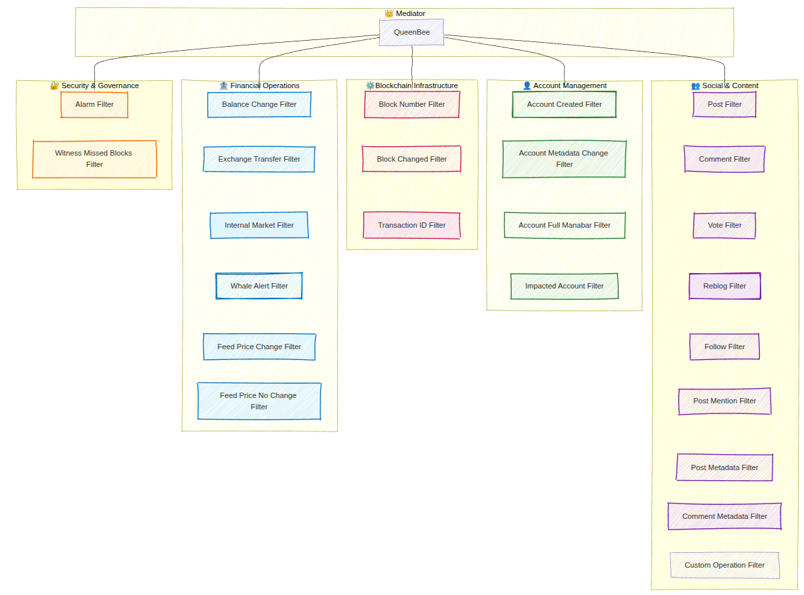

# Filters & Conditions

Filters are the core of WorkerBee's event system. They define **when** your observers should be triggered by evaluating blockchain conditions in real-time.

## :mag: Filter Overview

Filters monitor the blockchain for specific events and trigger your callbacks when conditions are met. They run concurrently and use smart caching to minimize API calls.

Below you can find a diagram presenting the set of predefined filter categories:

{.rounded-lg}

### Basic Filter Usage

```typescript:highlight="9"
import { WorkerBee } from '@hiveio/workerbee';

const bot = new WorkerBee();

await bot.start();

// Simple post filter
bot.observe
  .onPosts("alice")
  .subscribe({
    next: () => {
      console.log(`Alice created new post!`);
    }
  });
```

## :link: Logical Operators

WorkerBee supports powerful logical operators to combine multiple filter conditions using `AND` and `OR` operations.

### AND Operator (Explicit)

The **AND** operator requires **ALL** specified conditions to be met simultaneously. Use the explicit `.and` method to combine filters.

```typescript:highlight=3
// Both conditions must be true in the same block
bot.observe
  .onPosts("alice").and.onVotes("bob")
  .subscribe({
    next: (data) => {
      console.log("Alice posted AND Bob voted in the same block!", data);
    }
  });
```

### OR Operator (Implicit & Explicit)

The **OR** operator triggers when **ANY** of the specified conditions is met.

#### Implicit OR (Multiple accounts)

When you pass multiple accounts to a single filter method, WorkerBee automatically applies OR logic between them:

```typescript:highlight=3
// Triggers when alice OR bob creates a post
bot.observe
  .onPosts("alice").onPosts("bob")
  .subscribe({
    next: (data) => {
      console.log("Either Alice or Bob created a post!", data);
    }
  });
```

#### Explicit OR (Different filter types)

Use the explicit `.or` method to combine different types of filters:

```typescript:highlight=3
// Triggers when alice posts OR bob comments
bot.observe
  .onPosts("alice").or.onComments("bob")
  .subscribe({
    next: (data) => {
      console.log("Alice posted OR Bob commented!", data);
    }
  });
```

## :scales: Operator Precedence

!!!warning
**AND takes precedence over OR** - this is crucial for understanding complex filter combinations.
!!!

### How Precedence Works

WorkerBee processes filters by grouping OR operations first, then combining these groups with AND logic:

```typescript
// This creates: (alice posts OR bob posts) AND (charlie votes)
bot.observe
  .onPosts("alice").onPosts("bob")  // Implicit OR
  .and.onVotes("charlie") // new group
  .subscribe({
    next: (data) => {
      console.log("(Alice OR Bob posted) AND Charlie voted!", data);
    }
  });
```

### Complex Combinations

When chaining multiple AND operations, each `.and` creates a new group:

```typescript
// This creates: (alice posts) AND (bob votes) AND (charlie comments)
bot.observe
  .onPosts("alice")
  .and.onVotes("bob") // new group
  .and.onComments("charlie") // new group
  .subscribe({
    next: (data) => {
      console.log("All three conditions must happen in the same block!", data);
    }
  });

// This creates: (alice posts OR bob posts) AND (charlie votes OR dave comments)
bot.observe
  .onPosts("alice").onPosts("bob")  // Implicit OR
  .and.onVotes("charlie") // new group
  .or.onComments("dave")
  .subscribe({
    next: (data) => {
      console.log("(Alice OR Bob posted) AND (Charlie voted OR Dave commented)!", data);
    }
  });
```

---

## :books: Complete Reference

For comprehensive examples of all available filters, check out the complete API reference:

[!ref target="_blank" text="Browse All Filter Examples in API Reference"](/interfaces/api-reference/#filters)
