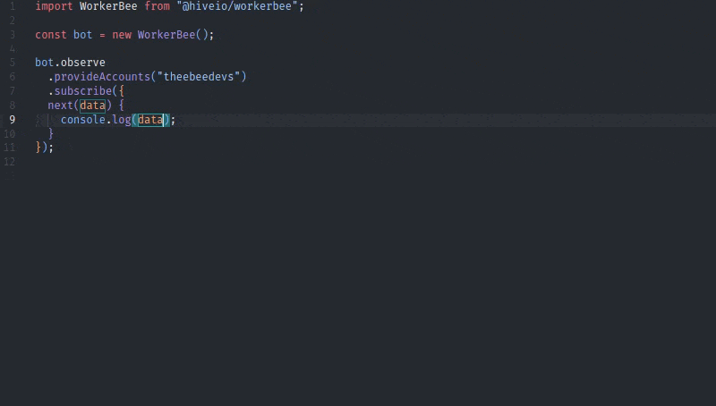

# Documentation Overview

Welcome to the complete documentation for WorkerBee! This section provides comprehensive guides, examples, and references for building powerful blockchain applications.

## :rocket: Getting Started

New to WorkerBee? Start here!

[!ref icon="rocket" text="Getting Started Guide"](./getting-started/)

Learn the basics of WorkerBee, installation, and your first blockchain observer.

## :mortar_board: Learning Path

### Beginner

1. [Getting Started](./getting-started/) - Basic concepts and first examples
2. [Base Configuration](./base-configuration/) - Setting up for your environment
3. [Filters & Conditions](./filters/) - Monitoring blockchain events

### Intermediate

1. [Data Providers](./providers/) - Working with blockchain data
2. [Common Patterns](./patterns/) - Best practices and reusable solutions
3. [Troubleshooting](./troubleshooting/) - Debugging and common issues

### Advanced

1. [Past Data](./past-data/) - Leveraging historical blockchain data
2. [Core Architecture](./core-architecture/) - Understanding the internals
3. [Advanced Examples](./examples/) - Real-world applications
4. [API Reference](./api-reference/) - Complete technical reference

## :sparkles: Essential Concepts

- **Observer Pattern**: Reactive programming for blockchain events
- **Fluent API**: Chain methods to build complex observations
- **Smart Caching**: Automatic optimization of API calls
- **Concurrent Processing**: Filters and providers run in parallel
- **Error Handling**: Built-in retry logic and failover mechanisms
- **Fully typed**: Library APIs have well defined types and functional interfaces with special support for IDE IntelliSense:

{.rounded-lg}

## :question: Need Help?

- **Issues & Bugs**: [WorkerBee GitLab Issues](https://gitlab.syncad.com/hive/workerbee/-/issues)
- **Hive Community**: [Hive.blog](https://hive.blog) posts tagged with `workerbee`

## :star: What Makes WorkerBee Special?

### For Blockchain Developers

- **No More Polling Loops**: Declarative event monitoring
- **Built-in Optimizations**: Smart caching and concurrent processing
- **Type Safety**: Full TypeScript support with excellent IDE integration
- **Multiple Data Sources**: Switch between RPC, REST, SQL without code changes

### For Application Developers

- **Web-like APIs**: Familiar reactive patterns, no blockchain complexity
- **Clean Data Models**: Normalized objects instead of raw blockchain data
- **Error Resilience**: Automatic retry and failover handling
- **Performance**: Up to 50% fewer API calls through intelligent caching

Start your blockchain application journey with WorkerBee today! :bee:
