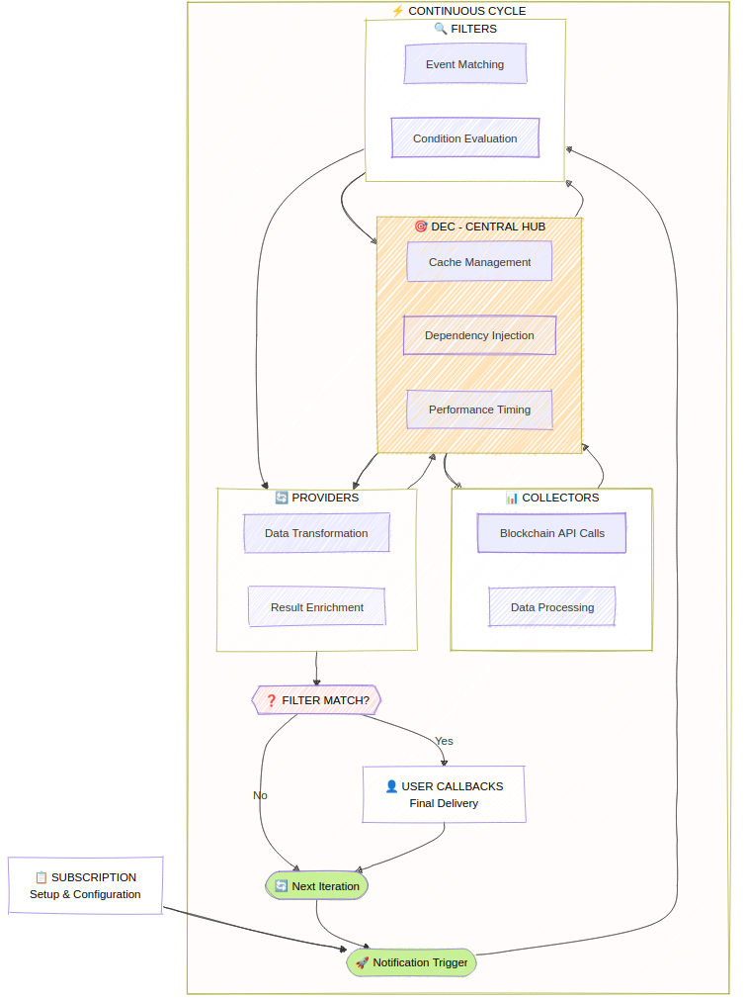
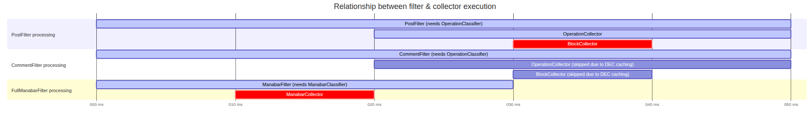

# Core Architecture

WorkerBee is built on a sophisticated multi-layered architecture that ensures high performance, reliability, and ease of use. Understanding this architecture helps you leverage WorkerBee's full potential.

TODO: Adjust this section and fix wrong information

## :mag: Architectural Overview

{.rounded-lg}

## :robot_face: Data Evaluation Context (DEC)

The **Data Evaluation Context** is WorkerBee's central nervous system. It orchestrates all data flow and provides:

### :gear: Dependency Injection

The DEC automatically resolves dependencies between collectors, ensuring the right data sources are available when needed:

```typescript
// When you use both post and account filters
workerbee.observe
  .onPosts("alice")
  .onAccountsBalanceChange(false, "alice")
  .subscribe(/* ... */);

// DEC automatically injects:
// - OperationCollector (for posts)
// - AccountCollector (for balance changes)
// - BlockCollector (dependency of both)
// - DynamicGlobalPropertiesCollector (dependency of BlockCollector)
```

### :repeat: Smart Caching System

Within each evaluation cycle, the DEC maintains a shared cache that dramatically reduces API calls:

```typescript
// These operations share cached blockchain data
workerbee.observe
  .onPosts("alice")      // Needs operation data
  .onComments("alice")   // Also needs operation data (shared cache!)
  .onVotes("alice")      // Also needs operation data (shared cache!)
  .subscribe(/* ... */);

// Result: 1 API call instead of 3! 🚀
```

### :hourglass_flowing_sand: Cycle Management

The DEC manages evaluation cycles intelligently:

- **Historical Mode**: Fast processing of past blocks
- **Live Mode**: Time-based cycles (default: 2 seconds)

## :mag_right: Filters Layer

Filters evaluate blockchain conditions and determine when your observers should be triggered.

### :zap: Parallel Execution

All filters run concurrently for maximum performance:

```typescript
workerbee.observe
  .onPosts("alice")           // Filter 1 (parallel)
  .onComments("bob")          // Filter 2 (parallel)
  .onAccountsBalanceChange(false, "charlie") // Filter 3 (parallel)
  .subscribe(/* ... */);
```

### :fast_forward: Short Circuit Evaluation

When any filter matches, WorkerBee uses short-circuit evaluation to stop unnecessary processing:

```typescript
workerbee.observe
  .onPosts("alice")     // ✅ Matches first
  .onComments("bob")    // ❌ Cancelled (short circuit)
  .onVotes("charlie")   // ❌ Cancelled (short circuit)
  .subscribe(/* ... */);
```

{.rounded-lg}

## :truck: Providers Layer

Providers gather and transform data for your observers, running only when filters pass.

### :package: Data Transformation

Providers normalize raw blockchain data into WorkerBee's clean API:

```typescript
// Raw blockchain operation data → Clean post objects
{
  "op": ["comment", {
    "parent_author": "",
    "parent_permlink": "hive",
    "author": "alice",
    "permlink": "my-post",
    "title": "Hello World",
    "body": "This is my post content...",
    "json_metadata": "{\"tags\":[\"hive\"]}"
  }]
}

// ↓ Becomes ↓

{
  posts: {
    alice: [{
      author: "alice",
      permlink: "my-post",
      title: "Hello World",
      body: "This is my post content...",
      tags: ["hive"],
      created: "2024-01-01T12:00:00.000Z"
    }]
  }
}
```

### :arrows_counterclockwise: Concurrent Processing

Like filters, providers run in parallel:

```typescript
workerbee.observe
  .onPosts("alice")
  .provideAccounts("alice", "bob")    // Provider 1 (parallel)
  .provideFollowCounts("alice")       // Provider 2 (parallel)
  .provideVotingPower("alice")        // Provider 3 (parallel)
  .subscribe(/* ... */);
```

## :shopping_trolley: Collectors Layer

Collectors are the data acquisition layer, responsible for fetching information from various sources.

## :arrows_clockwise: Data Flow Example

Let's trace a complete data flow for this observer:

```typescript
workerbee.observe
  .onPosts("alice")
  .provideAccounts("alice")
  .subscribe({
    next: ({ posts, accounts }) => {
      console.log('New post:', posts.alice[0].title);
      console.log('Alice balance:', accounts.alice.balance);
    }
  });
```

### Step-by-Step Flow

1. **DEC Initialization** 🧠
   - Analyzes required filters: `PostFilter`
   - Analyzes required providers: `AccountProvider`
   - Injects collectors: `OperationCollector`, `AccountCollector`, `BlockCollector`

2. **Data Collection** 🛒

   ```text
   BlockCollector → Fetches latest block data
   OperationCollector → Extracts operations from blocks
   AccountCollector → Fetches Alice's account data
   ```

3. **Filter Evaluation** 🔎

   ```text
   PostFilter → Checks operations for Alice's posts
   ✅ Found new post → Trigger providers
   ```

4. **Provider Execution** 🚚

   ```text
   PostProvider → Transforms post operations to clean objects
   AccountProvider → Transforms account data to clean objects
   ```

5. **Observer Callback** 🤳

   ```text
   Your code receives: { posts: {...}, accounts: {...} }
   ```

## :chart_with_upwards_trend: Performance Optimizations

### :memo: Caching Strategy

- **Per-Cycle Caching**: Data is cached only within each evaluation cycle
- **Atomic Snapshots**: All components see consistent blockchain state
- **Memory Efficient**: Cache is cleared between cycles

### :rocket: Concurrency Benefits

- **Filter Parallelism**: All conditions evaluated simultaneously
- **Provider Parallelism**: Data transformation happens concurrently
- **Short-Circuit Logic**: Unnecessary work is cancelled early

### :dart: Smart Resource Management

- **On-Demand Collection**: Data is only fetched when actually needed
- **Dependency Optimization**: Shared dependencies are resolved once
- **API Call Reduction**: Up to 50% fewer API calls in complex scenarios

## :wrench: Extensibility Points

### Custom Collectors

Implement custom data sources:

```typescript
class SqlCollector extends BaseCollector {
  async collect(context: DataEvaluationContext): Promise<SqlData> {
    // Custom SQL-based data collection
    return await this.sqlClient.query(/* ... */);
  }
}
```

### Custom Filters

Create specialized conditions:

```typescript
class CustomEventFilter extends BaseFilter {
  async evaluate(context: DataEvaluationContext): Promise<boolean> {
    // Custom evaluation logic
    return customCondition;
  }
}
```

### Custom Providers

Transform data in specialized ways:

```typescript
class CustomDataProvider extends BaseProvider {
  async provide(context: DataEvaluationContext): Promise<CustomData> {
    // Custom data transformation
    return transformedData;
  }
}
```

## :bulb: Architecture Benefits

### :muscle: Separation of Concerns

Each layer has a single responsibility, making the system maintainable and testable.

### :electric_plug: Loose Coupling

Components communicate through well-defined interfaces, allowing easy substitution.

### :chart_with_upwards_trend: High Performance

Concurrent execution and intelligent caching provide optimal performance.

### :gear: Flexibility

The layered architecture supports multiple data sources and custom extensions.

### :test_tube: Testability

Each component can be tested in isolation with dependency injection.

This architecture ensures that WorkerBee can scale from simple use cases to complex enterprise applications while maintaining excellent performance and developer experience.
